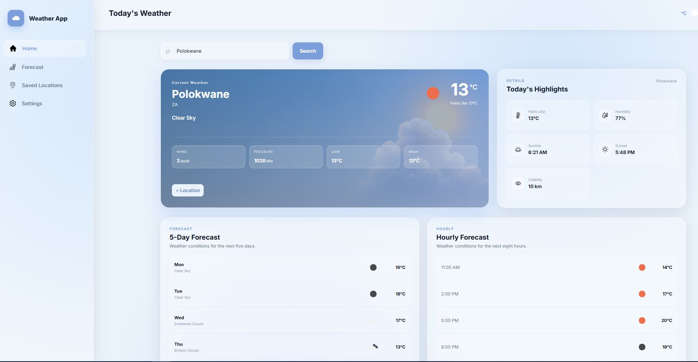

# 🌤️ Weather Application — React TypeScript

## 📌 Project Overview

This project is the **fourth official React task**, based on **React Lesson 4**.

The purpose of this task is to demonstrate how a React application can communicate with **third-party APIs** to request and consume external data.

In real-world applications, it is uncommon for an application to operate completely independently. Applications frequently communicate with external servers and services through **APIs (Application Programming Interfaces)** to retrieve or send information.

For this project, a weather API is consumed to retrieve weather information, which is then processed and displayed through a user-friendly React TypeScript interface.

The application allows users to view the weather for their **current location**, search for weather information in other locations, save locations, customise the application, and view weather forecasts.



## 🎯 Objective

The objective of this task is to demonstrate an understanding of:

* Consuming data from third-party APIs.
* Making API requests from a React application.
* Processing and displaying external data.
* Working with asynchronous operations.
* Managing application state.
* Using browser geolocation.
* Persisting user data.
* Creating responsive user interfaces.
* Handling loading and error states.
* Building a practical React application using external services.

## 🌦️ Application Scenario

The application is designed as a weather dashboard that allows users to:

* Automatically detect their current location.
* View the current weather conditions.
* Search for weather information in other locations.
* View hourly and daily forecasts.
* Save multiple locations.
* Switch between saved locations.
* Choose between different temperature units.
* Customise the application's theme.
* Access cached weather information when offline.

The goal is to provide users with a convenient weather experience without requiring them to repeatedly search for the same locations.

## ✨ Features

### 🌡️ 1. Real-Time Weather Information

The application retrieves current weather information from a third-party weather API.

Users can view information such as:

* Current temperature
* Weather condition
* Humidity
* Wind speed
* Wind direction
* Feels-like temperature
* Weather icons
* Location information

The application also provides forecast information.

### 🕐 Hourly Forecast

Users can view weather conditions for upcoming hours, including information such as:

* Temperature
* Weather conditions
* Weather icons
* Time

This provides users with a more detailed understanding of how the weather is expected to change throughout the day.

### 📅 Daily Forecast

Users can switch to a daily forecast view to see predicted weather conditions for upcoming days.

Daily forecast information can include:

* Maximum temperature
* Minimum temperature
* Weather condition
* Weather icon
* Date

Users can choose between **hourly** and **daily** forecast information.

## 📍 2. Location-Based Forecasting

### Automatic Location Detection

The application can use the browser's **Geolocation API** to detect the user's current location.

The user must grant permission before their location can be accessed.

Once the location is detected, the application retrieves weather information for those coordinates.

### 🔎 Location Search

Users can search for weather information by entering a location into the search field.

For example:

```text
Polokwane
Johannesburg
Cape Town
Durban
Thohoyandou
London
New York
```

The application then requests the relevant weather information from the weather API.

### 📌 Current Location

The application provides weather information for the user's current location when location access is available.

If location access is unavailable or denied, the application can use a fallback location.

### 🌎 Searched Locations

Users can search for other locations and view their weather information without changing their actual device location.

## 🚨 3. Weather Alerts

The application is designed to support severe weather alerts.

When severe weather information is available for the user's location, the application can notify the user about important weather conditions.

Potential alerts may include:

* Severe storms
* Heavy rainfall
* Extreme temperatures
* Strong winds
* Other hazardous weather conditions

> **Note:** Actual push notifications depend on the capabilities and data provided by the selected weather API and browser notification support.

## 📍 4. Multiple Locations

Users can save multiple locations so they do not need to search for the same location repeatedly.

For example, users could save:

```text
📍 Polokwane
📍 Johannesburg
📍 Cape Town
📍 Thohoyandou
```

Users can then select a saved location to quickly view its weather information.

Saved locations are persisted using browser storage.

## 🎨 5. Customisation

The application provides options for users to customise their weather experience.

### 🌙 Theme

Users can customise the appearance of the application by switching between themes such as:

* Light mode
* Dark mode

The selected theme can be persisted so that it remains after refreshing the application.

### 🌡️ Temperature Units

Users can select their preferred temperature unit.

Supported units include:

* Celsius (°C)
* Fahrenheit (°F)

The selected unit is applied to the weather information displayed throughout the application.

## 📡 6. Offline Access

The application is designed to support cached weather information.

Previously retrieved weather data can be stored locally so that useful weather information can still be displayed when an internet connection is temporarily unavailable.

This improves the user experience when:

* The internet connection is unstable.
* The user temporarily goes offline.
* The API cannot be reached.

> Cached data may become outdated because weather conditions change continuously.

## ⚡ 7. Performance

Performance is an important part of the application.

The project focuses on:

* Fast initial loading.
* Efficient API requests.
* Avoiding unnecessary API calls.
* Reusable React components.
* Efficient state management.
* Responsive layouts.
* Optimised rendering.
* Handling loading states.
* Handling API errors gracefully.

Loading indicators are provided while weather information is being retrieved.

## 🔐 8. Privacy & Security

The application respects user privacy when accessing location information.

The browser's Geolocation API requires the user's permission before accessing their location.

The application should:

* Only request location access when necessary.
* Clearly communicate why location access is required.
* Avoid unnecessarily storing sensitive location information.
* Handle denied location permissions gracefully.
* Protect API credentials where applicable.
* Avoid exposing sensitive information in the client-side application.

> API keys should not be committed to a public GitHub repository. Where supported, environment variables should be used to manage configuration securely.

## 🛠️ Technologies Used

* **React** – User interface development.
* **TypeScript** – Type-safe application development.
* **CSS** – Application styling and responsive design.
* **Vite** – Development server and build tool.
* **Weather API** – Retrieving weather information.
* **Browser Geolocation API** – Detecting the user's location.
* **Local Storage** – Persisting locations, preferences, and cached information.
* **Git & GitHub** – Version control.

> **Note:** The application uses **plain CSS** for styling.

## 🔌 API Integration

The application communicates with a third-party weather service to retrieve weather information.

A typical API flow is:

```text
User
  │
  ▼
React Application
  │
  ▼
Search / Geolocation
  │
  ▼
Weather API
  │
  ▼
Weather Data
  │
  ▼
React State
  │
  ▼
Weather UI
```

The application sends a request to the weather API using either:

* The user's latitude and longitude.
* A searched location.

The returned API response is then processed and displayed through React components.

## 🔄 Data Flow

The general data flow of the application is:

```text
User searches for location
          ↓
React handles search
          ↓
API request is created
          ↓
Weather API receives request
          ↓
Weather data is returned
          ↓
Response is processed
          ↓
React state is updated
          ↓
Components re-render
          ↓
Weather information displayed
```

## 🧩 React Concepts Demonstrated

### Components

The application is divided into reusable components to make the code easier to maintain.

A possible project structure is:

```text
src/
├── assets/
├── components/
│   ├── Header.tsx
│   ├── SearchBar.tsx
│   ├── WeatherCard.tsx
│   ├── ForecastSection.tsx
│   ├── HourlyForecast.tsx
│   ├── DailyForecast.tsx
│   ├── LocationList.tsx
│   ├── ThemeToggle.tsx
│   └── LoadingState.tsx
├── services/
│   └── weatherService.ts
├── types/
│   └── weather.ts
├── App.tsx
├── App.css
├── index.css
└── main.tsx
```

The exact component structure may vary depending on the implementation.

### React State

React state is used to manage dynamic information such as:

* Weather data
* Forecast data
* Search input
* Current location
* Saved locations
* Temperature units
* Theme
* Loading status
* Error messages

### React Hooks

React hooks such as:

```typescript
useState()
useEffect()
```

can be used to manage application state and perform operations such as fetching weather data when the application loads or when a location changes.

## 💾 Data Persistence

Browser storage is used to persist information such as:

* Saved locations
* Temperature unit preference
* Theme preference
* Cached weather information

This means users do not necessarily have to reconfigure the application every time they refresh the page.

## 📱 Responsive Design

The weather application is designed to work across:

* 📱 Mobile devices
* 📲 Tablets
* 💻 Laptops
* 🖥️ Desktop computers

CSS media queries and responsive layout techniques are used to ensure that weather cards, navigation, forecasts, search elements, and other UI components adapt to different screen sizes.

## 🎨 User Interface

The interface focuses on creating a modern and intuitive weather experience.

Important UI elements include:

* Weather dashboard
* Search bar
* Current weather card
* Location information
* Temperature display
* Weather condition
* Forecast cards
* Hourly forecast
* Daily forecast
* Saved locations
* Theme controls
* Temperature unit controls
* Loading states
* Error states

The design prioritises readability and makes important weather information easy to identify.

## 🚀 Getting Started

### Prerequisites

Make sure you have the following installed:

* Node.js
* npm
* Git

### Clone the Repository

```bash
git clone <your-repository-url>
```

Navigate into the project directory:

```bash
cd <project-folder>
```

### Install Dependencies

```bash
npm install
```

### Configure Environment Variables

If the weather API requires an API key, create an environment file:

```text
.env
```

Add the required API configuration:

```env
VITE_WEATHER_API_KEY=your_api_key_here
```

> Do not commit your `.env` file or expose private API credentials in a public repository.

### Start the Development Server

```bash
npm run dev
```

The application will be available at the local development URL provided by Vite.

## 🏗️ Build for Production

Create a production build:

```bash
npm run build
```

Preview the production build:

```bash
npm run preview
```

## 🧪 Testing

The application should be tested to ensure that:

* Current weather information loads correctly.
* The user's location can be detected when permission is granted.
* The application handles denied location permissions.
* Users can search for locations.
* Weather information for searched locations is displayed.
* Hourly forecasts are displayed correctly.
* Daily forecasts are displayed correctly.
* Users can switch between hourly and daily forecasts.
* Multiple locations can be saved.
* Saved locations can be selected.
* Saved locations remain available after refreshing the application.
* Celsius and Fahrenheit options work correctly.
* Light and dark themes work correctly.
* Cached weather data can be accessed when offline.
* Loading states are displayed while data is being retrieved.
* API errors are handled appropriately.
* The application works on mobile and desktop screens.

## ⚠️ Error Handling

The application handles common situations such as:

* Invalid locations
* Failed API requests
* No internet connection
* API errors
* Geolocation permission denied
* Geolocation unavailable
* Missing weather data
* Loading states

Users should receive appropriate feedback instead of being presented with a broken or empty interface.

## 🔮 Future Improvements

The application can be expanded with additional features such as:

* User accounts and authentication.
* Cloud synchronisation.
* Weather radar maps.
* Interactive weather maps.
* Air quality information.
* UV index information.
* Sunrise and sunset information.
* Pollen information.
* More detailed weather alerts.
* Push notification support.
* Weather widgets.
* PWA installation.
* Background weather updates.
* Automatic location refresh.
* Multiple weather API providers.
* Backend database integration.
* Personalised weather preferences.

## 🌐 Deployment

The application can be deployed using platforms such as:

* GitHub Pages
* Firebase Hosting
* Vercel
* Netlify

### Live Demo

**Live Application:** `https://task-3-react-weather-app-henna.vercel.app/`

### GitHub Repository

**Repository:** `https://github.com/SenseiTumelo/Task-3-React-Weather-App.git`

## 📚 Learning Outcomes

This project demonstrates practical knowledge of:

* React TypeScript.
* React components.
* React hooks.
* State management.
* API consumption.
* Asynchronous JavaScript.
* Fetching external data.
* REST API concepts.
* Browser Geolocation API.
* Local Storage.
* Data persistence.
* Error handling.
* Loading states.
* Responsive web design.
* CSS styling.
* Theme management.
* Unit conversion.
* Third-party API integration.

